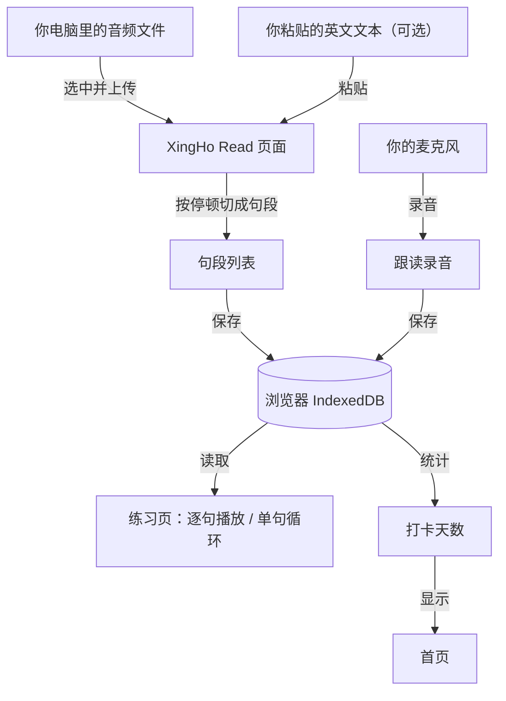

# XingHo Read　技术设计文档（TECH_DESIGN）

| 项目信息 | 内容 |
|---|---|
| 产品名称 | XingHo Read |
| 所属项目 | vibe coding（第 1 周 Day 5） |
| 文档日期 | 2026-09-20 |
| 上游依据 | `PRD.md`（Day 4，含 41 项可判定验收标准） |
| 文档状态 | 待用户审阅 |

---

## 一、一句话说清数据流向

> **数据从「你在自己电脑里选中一个音频文件」开始，到「存进你自己浏览器的本地存储」结束——全程不经过任何服务器，只有你自己能看到、也只有你自己的浏览器能打开。**

这一句话就是整套设计的骨架：**没有上传，没有云端，没有别人**。

---

## 二、数据从哪来、到哪去

### 数据来源（三个入口）

| # | 数据 | 从哪来 |
|---|---|---|
| ① | **音频文件** | 你在自己电脑里选一个音频文件上传（支持 mp3 / m4a / wav / ogg） |
| ② | **英文文本**（可选） | 你粘贴进来 |
| ③ | **你的录音** | 你的麦克风（由浏览器录音） |

### 数据流向表

| 数据 | 从哪来 | 存在哪 | 到哪去 |
|---|---|---|---|
| 音频文件 | 你从电脑里选中 | 浏览器 IndexedDB | 被切成句段 → 播放 → 单句循环 |
| 英文文本（可选） | 你粘贴 | 浏览器 IndexedDB | 练习页的句子列表里逐句显示 |
| 句段（切好的小段音频） | 系统按停顿自动切分 | 浏览器 IndexedDB | 逐句播放、单句循环、跟读的对照对象 |
| 你的录音 | 麦克风 | 浏览器 IndexedDB | 回听、和原声对比 |
| 打卡记录 | 完成跟读录音时产生 | 浏览器 IndexedDB | 首页的「连续打卡 N 天」「本月天数」 |

**一句话概括每一行**：所有数据**来源只有两个**（你的文件、你的麦克风），**存放只有一处**（浏览器 IndexedDB），**去向也只有一个**（同一个浏览器里的页面）。

---

## 三、数据流图

### 图（Mermaid，GitHub 网页上会自动渲染成图）



### 同一张图的纯文本版（记事本里也能看）

```
【数据从哪来】
  ① 你电脑里的音频文件  ──上传──▶  XingHo Read 页面
  ② 你粘贴的英文文本    ──粘贴──▶  XingHo Read 页面（可选）
  ③ 你的麦克风          ──录音──▶  练习页

【数据在中间怎么走】
  页面把音频 ──按停顿切成句段──▶ 句段列表

【数据到哪去】
  句段列表 + 你的录音  ──保存──▶  浏览器 IndexedDB（只在你本机）
  IndexedDB            ──读取──▶  练习页（逐句播放 / 单句循环 / 跟读回听）
  IndexedDB            ──统计──▶  首页（连续打卡 N 天 / 本月天数）
```

### 从图里能读出的三件事

1. **没有服务器**——图上没有任何一个环节跑在别人的机器上。
2. **只有一个存储点**——所有东西都进 `IndexedDB` 这一个仓库，出来也只有页面自己在读。
3. **出口全是「界面」**——数据的最终去向都是给你看的界面，没有一处是发给别人的。

---

## 四、技术路线

| 用途 | 用什么 | 为什么选它 |
|---|---|---|
| 界面框架 | **React + Vite** | 三个页面（首页 / 练习页 / 新建页）各写成一个组件，职责清楚；以后加功能不用翻改旧代码。Vite 是配套的构建工具，负责把代码跑起来、打包 |
| 界面样式 | **手写 CSS** | 只依赖 CSS 本身，不引入额外规则；出问题时容易定位。第一版界面朴素是可以接受的 |
| 编程语言 | **JavaScript（不用 TypeScript）** | 第一版的瓶颈是「功能做对」，不是类型安全；少一层语法负担，出错信息也更直白 |
| 把音频按停顿切成句段 | **Web Audio API** | 浏览器自带能力：读出音频波形 → 在句与句之间的静音处切开。**不装第三方库、不花钱**，符合「全程免费」的目标 |
| 逐句播放 / 单句循环 | **HTML 音频播放 + React 状态控制** | 播放是浏览器原生能力；「循环哪一句、循环几次、播完去哪」由前端代码的状态控制，逻辑清晰可测 |
| 跟读录音 / 回听 | **MediaRecorder API** | 浏览器自带的录音能力，不需要装插件、不需要额外服务 |
| 存储材料 / 音频 / 录音 / 打卡 | **IndexedDB** | 音频和录音是**二进制大文件**，`localStorage` 装不下；IndexedDB 能存二进制、容量大，且完全在本机 |
| 连续天数 / 本月天数 | 数据存 IndexedDB，**在界面里现算** | 数据量极小（就是几个日期），不值得再引入统计方案 |
| 版本管理 | **Git + GitHub** | 已连续使用四天，流程熟练，不需要更换 |
| 运行方式 | 先在**你自己电脑的浏览器**里跑（Vite 开发服务器），用 Chrome / Edge 最新版 | 发布到公网让同学访问，**不在本期范围**，等后续清单安排 |

---

## 五、这一版不引入的东西（以及为什么）

| 不引入 | 为什么 |
|---|---|
| 后端服务器 | 没有账号、数据不给别人看、没有多人共用 —— 三个判断依据都是「否」（详见 PRD 第五段） |
| 服务器端数据库 | 没有后端，自然没有它；浏览器自带的 IndexedDB 承担了这个小仓库的角色 |
| 账号 / 登录系统 | PRD 明确列为本期不做 |
| TypeScript | 第一版不需要，减少学习与排查成本 |
| 现成 UI 组件库 | 第一版页面简单，引入组件库反而被它的规矩绑住，体积也大 |
| 视频素材 | PRD 明确列为本期不做；且视频里的音频不能被浏览器直接解码做断句，工作量大 |

---

## 六、已知的技术风险（写清代价，不藏）

| 风险 | 说明 | 应对 |
|---|---|---|
| **断句可能不准** | 自动切句依赖素材质量：音频要读得清晰、句间有可辨识的停顿。整段不停顿的素材会切错 | 这是 PRD 里写明的**前提条件**；Day 7 用真实素材实测；实在不行再考虑后续版本加「手动微调句段边界」 |
| **数据只在本机** | 清空浏览器数据、换电脑、换浏览器 → 材料可能丢失 | 这是「不做云端同步」的必然代价，已在 PRD 中确认；使用前需知晓 |
| **浏览器兼容** | 录音（MediaRecorder）与 IndexedDB 在现代浏览器都支持，老旧浏览器可能不行 | 本期先约定使用 Chrome / Edge 最新版 |
| **首次安装依赖需要联网** | React + Vite 需要下载依赖包（已实测 npm 官方源与国内镜像均可达） | 若安装缓慢，改用国内镜像源 |

---

## 七、这份文档的下游

- **Day 7 写代码**：照着第四节的路线开工，照着第三张图安排各模块之间的数据传递。
- **验收时**：用 PRD 的 41 项验收标准逐条对照，其中 F2、F3 以本文档第三节的数据流为运行依据。
- **方案变化时**：本文档一旦修改，受影响的文件与功能需重新核对（这一项可在余力加练里展开）。
